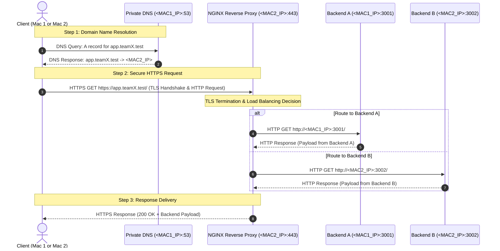

# Network Topology and Architecture

## Private Network Service Platform

This document describes the physical and logical network topology for the two-machine setup running macOS on a shared Local Area Network (LAN).

---

## 1. Physical & Host Topology

The platform is distributed across two macOS machines connected via the local network:

```
               +------------------------------------------+
               |             Local Area Network           |
               |                  (LAN / Wi-Fi)           |
               +--------------------+---------------------+
                                    |
            +-----------------------+-----------------------+
            |                                               |
            v                                               v
+-----------------------+                       +-----------------------+
|         Mac 1         |                       |         Mac 2         |
|      (<MAC1_IP>)      |                       |      (<MAC2_IP>)      |
+-----------------------+                       +-----------------------+
| - Member 1            |                       | - Member 2            |
| - Private DNS server  |                       | - NGINX Edge /        |
|   (dnsmasq:53)        |                       |   Reverse Proxy (443) |
| - Backend A           |                       | - HTTPS / TLS Edge    |
|   (Node.js:3001)      |                       | - Backend B           |
| - Client environment  |                       |   (Node.js:3002)      |
|                       |                       | - Client environment  |
+-----------------------+                       +-----------------------+
```

### Machine Roles & Responsibilities

| Host | Assigned Member | IP Address | Services & Components | Ports |
| :--- | :--- | :--- | :--- | :--- |
| **Mac 1** | Member 1 | `<MAC1_IP>` | - Private DNS Server (`dnsmasq`)<br>- Node.js Backend A<br>- Client Testing Environment | `53` (UDP/TCP)<br>`3001` (HTTP)<br>- |
| **Mac 2** | Member 2 | `<MAC2_IP>` | - NGINX Edge / Reverse Proxy & Load Balancer<br>- HTTPS/TLS Termination<br>- Node.js Backend B<br>- Client Testing Environment | `80` (HTTP redirect)<br>`443` (HTTPS)<br>`3002` (HTTP)<br>- |

---

## 2. Component Details

### Mac 1 (Member 1)
- **Private DNS Server (`dnsmasq`)**: Listens on `<MAC1_IP>:53`. Resolves custom private domains (such as `app.teamX.test`) to the edge reverse proxy on Mac 2 (`<MAC2_IP>`).
- **Backend A**: Node.js application service listening on `<MAC1_IP>:3001`. Serves dynamic application responses when proxied by NGINX.
- **Client**: Testing tools (`curl`, browser, automated scripts) configured to use `<MAC1_IP>` as their primary DNS resolver.

### Mac 2 (Member 2)
- **NGINX Edge / Reverse Proxy & Load Balancer**: Listens on `<MAC2_IP>:443` (HTTPS) and `<MAC2_IP>:80` (HTTP to HTTPS redirection). Acts as the single entry point for all application traffic, balancing requests across Backend A and Backend B.
- **HTTPS / TLS**: TLS termination handled by NGINX using generated private certificates for `app.teamX.test`.
- **Backend B**: Node.js application service listening on port `3002` (accessible locally or via `<MAC2_IP>:3002`).
- **Client**: Testing tools (`curl`, browser, automated scripts) configured to use `<MAC1_IP>` as DNS resolver to validate end-to-end access from Mac 2 as well.

---

## 3. Logical Request Flow



### Flow Step Explanation

1. **Client Request Initiation**:
   - A client on either Mac 1 or Mac 2 requests a service URL (e.g., `https://app.teamX.test`).

2. **DNS Resolution**:
   - The client queries the Private DNS server running on Mac 1 (`<MAC1_IP>:53`).
   - The DNS server resolves `app.teamX.test` to `<MAC2_IP>` (Mac 2 NGINX edge).

3. **HTTPS Request to Edge Proxy**:
   - The client initiates an HTTPS connection on port `443` to `<MAC2_IP>`.
   - NGINX on Mac 2 performs TLS handshake, terminates encryption, and inspects the request.

4. **Reverse Proxy & Load Balancing**:
   - NGINX load balances the incoming request between the two backend instances:
     - **Backend A**: Proxied over LAN to `http://<MAC1_IP>:3001`
     - **Backend B**: Proxied to `http://<MAC2_IP>:3002` (or `http://127.0.0.1:3002`)

5. **Response Return**:
   - The selected backend processes the request and responds with application data.
   - NGINX wraps the response in TLS encryption and transmits it back to the client.
